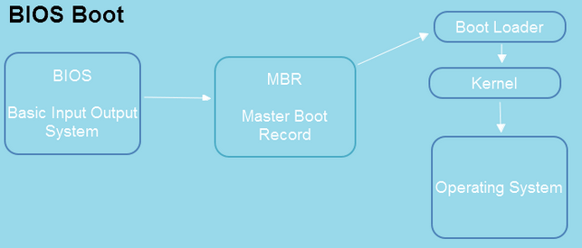

# Bootstrapping

## What is it?

It can be thought of as a process through which a complex system is set up using a much simpler system.

*From [wikipedia](https://en.wikipedia.org/wiki/Bootstrapping)*: "Tall boots may have a tab, loop or handle at the top known as a bootstrap, allowing one to use fingers or a boot hook tool to help pulling the boots on.  The saying "to pull oneself up by one's bootstraps" was already in use during the 19th century as an example of an impossible task."

Bootstrapping an OS ("booting the OS") involves getting the computer's **firmware** (BIOS, or equivalent) from a fixed location on disk in order to run a simple program which in turn starts a more complex initialisation routine. This is just scratching the surface though.

From the slides, we know there are around 7 general steps, but this is arguable and you will see a variety of answers on the web.

More resources:
- "Understanding the Linux Boot Process". (Youtube) From: https://www.youtube.com/watch?v=mHB0Z-HUauo 

---

## The Steps

### 1. Power on and hardware checks are completed.

### 2. BIOS is then run.

Nowadays you see UEFI systems as well as BIOS.

There are noticeable differences between the two. Practically, they're the same thing. 

UEFI (i.e. UEFI BIOS) and BIOS (i.e. [Legacy](https://www.computerhope.com/jargon/l/legacy.htm) BIOS or traditional BIOS), are two types of a computer's motherboard [firmware](https://www.lifewire.com/what-is-firmware-2625881), which defines how a PC turns on, which drive it boots from, what peripherals (e.g. keyboard and mouse) it recognizes and even the frequency at which it runs the CPU. 

Both UEFI and BIOS are low-level software that starts when you boot your PC before booting your operating system.

References:
- "What is BIOS in a computer and how does it work?". (The Windows Club). From: https://www.thewindowsclub.com/what-is-bios-in-computers-how-does-it-work
- "UEFI vs. BIOS: What's the Difference and Which is Better". (EaseUS). From: https://www.easeus.com/partition-manager-software/uefi-vs-bios.html

More resources:
* https://www.lifewire.com/bios-basic-input-output-system-2625820
* https://flint.cs.yale.edu/feng/cos/resources/BIOS/
* https://computer.howstuffworks.com/bios1.htm

### 3. MBR Loaded. 

The MBR (Master Boot Record) provides the information on loading the operating system and also on the partition of the hard disk. 
The programs residing in master boot record help determine which partition needs to be used while booting.

A master boot record is generally 512 bytes or more.

BIOS will automatically check all hardware devices when users launch the PC. 

After that, the system bootstrapping will read the MBR from [Cylinder-Head-Sector (CHS)](https://www.thomas-krenn.com/en/wiki/CHS_and_LBA_Hard_Disk_Addresses) to memory. And then, it can execute the master boot record.

Master boot record will check the hard disk partition table to see whether it is in good order and seeks an "active" bootable partition in the partition table. 

Nowadays, modern computers use GPT (GUID Partition Table) as it is a newer standard with many advantages including support for larger drives and is required by most modern PCs. Only choose MBR for compatibility if you need it.

*In short:*  

MBR (Master Boot Record) and GPT (GUID Partition Table) are two different ways of storing the partitioning information on a drive. This information includes where partitions start and begin, so your operating system knows which sectors belong to each partition and which partition is bootable.

References:
- What is MBR?". (Minitool) From: https://www.minitool.com/lib/mbr-master-boot-record.html 
- "What’s the Difference Between GPT and MBR When Partitioning a Drive?" (How To Geek). From: https://www.howtogeek.com/193669/whats-the-difference-between-gpt-and-mbr-when-partitioning-a-drive/
- "What is the Master Boot Record?". (Tecnopedia). From: https://www.techopedia.com/definition/3386/master-boot-record-mbr


### 4. GRUB is loaded.

GRUB (GRand Unified Bootloader) is the default bootloader for many of the Linux distributions. It will load a selected kernel.

References:
- "What exactly is GRUB?". (StackOverflow). From: https://askubuntu.com/questions/347203/what-exactly-is-grub 

More resources:
- https://itsfoss.com/what-is-grub/

### 5. Kernel is loaded.

The Linux kernel is a piece of code, thus it must be stored somewhere on the file-system, such that every time the system reboots, the kernel is loaded in the memory.

In Debian/Ubuntu systems, the Linux kernel can be found within the `/boot` directory.

The kernel is loaded in from the filesystem by GRUB, it loads drivers, kernel modules and filesystems.

It manages the entire functioning of the Linux system. From scheduling the processes to providing resources to applications, the Linux kernel does it all. 

References:
- "The Linux Kernel – Explained in an Easy to Understand Way". (LinuxForDevices). From: https://www.linuxfordevices.com/tutorials/linux/linux-kernel

More Resources:
- https://www.redhat.com/en/topics/linux/what-is-the-linux-kernel

### 6. init is started

The kernel then starts the init program which essential starts off every other process that the system needs to run, like network services
and other daemons (background processes).

More resources:
- https://www.tecmint.com/systemd-replaces-init-in-linux/

---

## Recap

- BIOS first run a Power-on self-test (POST) to check hardware like memory, disk drives and that it works properly.
- Then BIOS checks the Master Boot Record (MBR), which is a 512 byte section located first on the Hard Drive. 
  It looks for a bootloader (like GRUB). The hard drive's partition tables are also located here. 
- When you choose which distro or kernel you want to use, GRUB loads the selected kernel. 
- The kernel starts init (or systemd), which is the first process to start in Linux. 
- init then starts other processes like network services and other that you might have configured to start at boot time. 



For more information, type into your console:

```bash
$ man 7 boot
$ man 7 bootup
```