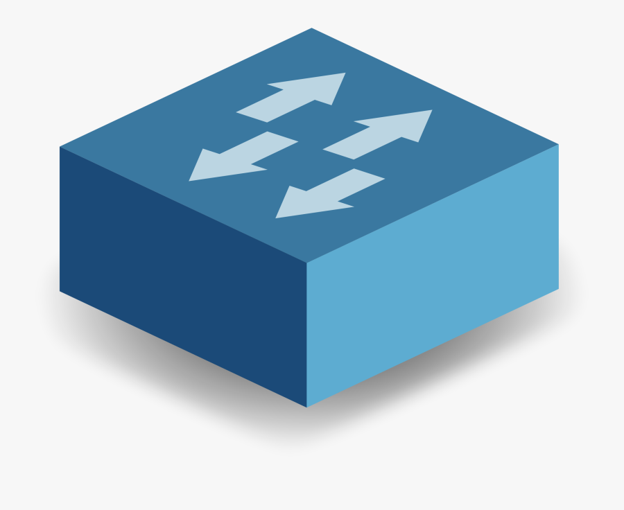

# Routers, Switches, Modems

In your home network, which we call a *LAN* (Local Area Network), you'll most likely have a **router** and a **modem**.

Sometimes you'll see them together in the one box, these are commonly known as **modem routers**.

Your *router* does a number of things. It acts as your wireless access point (WAP) for your house by connecting devices (such as phones, computers, TVs, etc) together through radio wave technology (wireless connection).

However, modern routers also afford connection via Ethernet cabling (wired connection). A typical home router is an example of a [edge router](https://www.techtarget.com/searchnetworking/definition/edge-router) but this is much more than you need to know.

"While a wireless router can direct local traffic on a network, a modem is required if Internet access is desired. In many cases, \[asychronous\] digital subscriber line (\[A\]DSL) and cable Internet service providers (ISPs) provide a pre-configured modem to connect to their service." - basically we need a modem to *decode* the signal from our ISP (like Optus, for example) in order to gain access to the big bad Internet. The details here are unimportant.

<figure>
    
    <figcaption><a href=https://www.easytechjunkie.com/what-is-a-wireless-router.htm>EasyTechJunkie</a> - Wireless Router</figcaption>
</figure>

This router has software on it which is in charge of executing many protocols such as DHCP, NAT, ARP, and more.

**Switches** are a little different. They also connect devices together in a LAN, but exclusively via Ethernet technology (e.g., [CAT cables](https://external-content.duckduckgo.com/iu/?u=https%3A%2F%2Fs3-ap-southeast-2.amazonaws.com%2Fwc-prod-pim%2FJPEG_1000x1000%2FCOC502BB_comsol_twin_cat5_cable_2m_blue.jpg&f=1&nofb=1)). Modern home routers integrate these Ethernet switches directly into the unit as one of their core functions. So *why* do we use switches? 

Well, routers are more commonly used to describe the technology which connects LANs together to create larger networks like the Internet. The following icon is used to describe a router:

<figure>
    
</figure>

And this icon for a switch:

<figure>
    
</figure>

But this is what a typical switch will look like, it has lots of Ethernet ports unlike the router image above which only has 4 ports. (the word *port* here is used to describe the hole in which we plug the cable into, not like a computer port).
 
<figure>
    
    <figcaption><a href=https://www.lifewire.com/definition-of-network-switch-817588>LifeWire</a> - Switch</figcaption>
</figure>