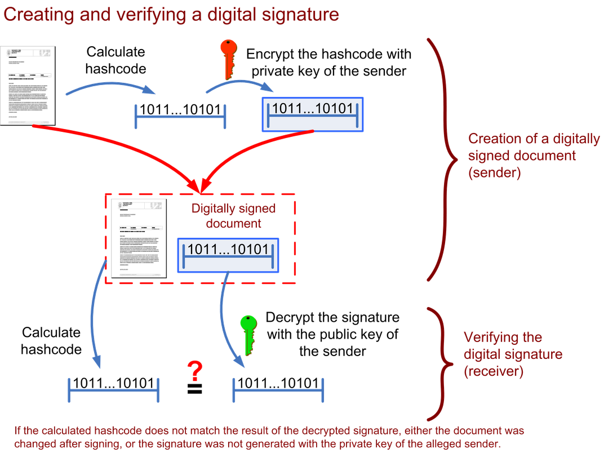

# Digital Signatures

You should read `encryption.md` before you read this otherwise it won't make sense.

I mentioned in that document that within asymmetric crypto, we have two keys and we can use either key to encrypt and the other to decrypt.

When we encrypt with the public key, this is known as just good old regular encryption.

When we encrypt with the private key, this is known as a digitally signing.

What makes a key a public key or a private key is which one you willingly distribute to other communicating parties.

After you generate your pair of keys, you will give one (the public key) to the person (or entity, like Ed) and keep the other (the private key) for yourself.

> Usually when you generate these keys, one will be assigned 'public' and the other 'private' just like when we used `ssh-keygen`

## Why is this important?

When we sign (or encrypt) data with our private key, we are crafting a _DIGITAL SIGNATURE_.

Since NO ONE ELSE has a copy of our private key, when someone decrypts the signature using our matching public key, they can verify that the message came from us. 

See below!

## Summary

Taken from [writework](https://www.writework.com/essay/digital-signatures)

**QUESTION:** Why do we sign the hash of the document and not the document itself?

**ANSWER:** Because it's faster to sign the hash since it's smaller in size!