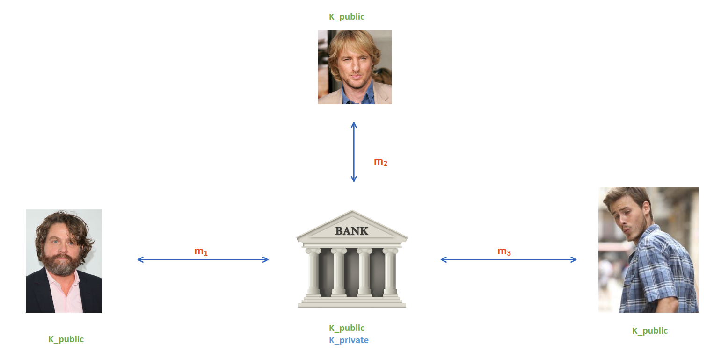
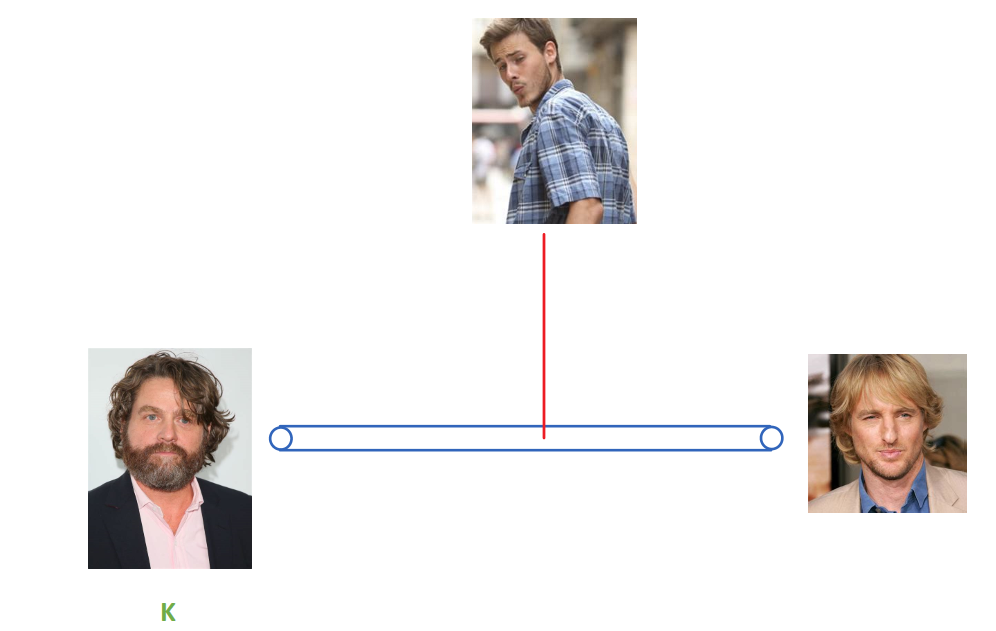
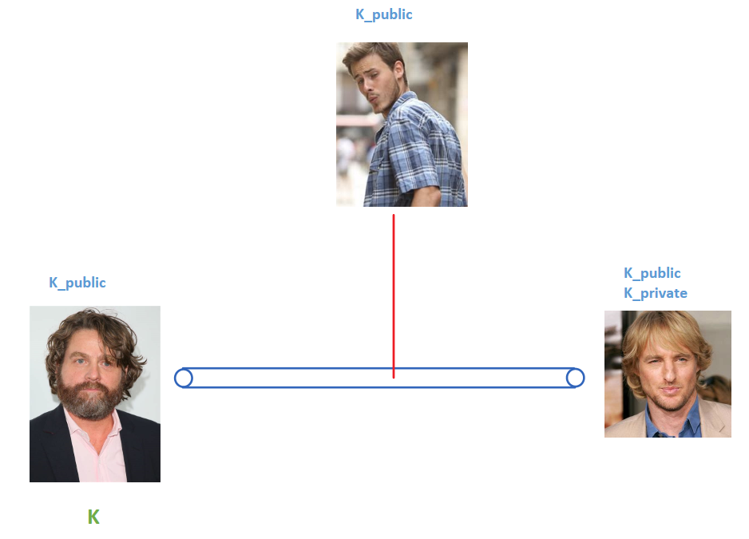

# Encryption

First thing I want to note: Encryption is NOT Encoding. Do NOT get these words confused.

Encoding is changing the format of a value such as going from the decimal number 5 to binary 00000101. The value remains the same.

Encryption, on the other hand, has the goal of completely obscuring the value of the data. Essentially, we want to scramble it up until the result has absolutely no tie to the original message.

## Symmetric Encryption

This type of encryption only involves ONE key. This key will be used to scramble (encrypt) and unscramble (decrypt) our data.

We use the following syntax to represent encryption:

```python
E(m,k) = c
D(c,k) = m
```
where:

* E() is our encryption function
* D() is our decryption function
* k is our key
* m is our message we want to send (we call this plaintext),and 
* c is our ciphertext (our scrambled data)

A great example to remember for this type of encryption is **AES** (Advanced Encryption Standard). Here's a [great comic](https://www.moserware.com/2009/09/stick-figure-guide-to-advanced.html) which shows how it works. 

I remember it as the _S_ in _AES_ can stand for **symmetric**.

## Asymmetric Encryption

This type of encryption involves TWO keys. 

The notion of a key can be slightly misleading, we can use EITHER key to encrypt our data, but we have to use the other to decrypt it.

An easy way to think about it is: you can put your message in a box where you can use any key to lock the box, but the other key is the ONLY key to unlock it.

```python
E(m, K_1) = c
D(c, K_2) = m
```

or

```python
E(m,K_2) = c
D(c,K_1) = m
```

We typically call one key, K_1, our public key, and the other, K_2, our private key.

A great example to remember for this type of encryption is **RSA**. I remember it as the _A_ in _RSA_ can stand for **asymmetric**.

This type of encryption is also known as public key cryptography. **Why??**

### Analogy Time



Our three favourite celebrities are trying to do some online banking, each is sending a message, **m_x**, UNENCRYPTED! (๏  。๏)

Anyone intercepting their messages could easily read their banking information!

What do we do?

Let's have each of our celebrities encrypt their messages, but with what key?? 

Prior to any communication, the bank will generate a public and private key pair (**K_public**, **K_private**) and give each celebrity a copy of **K_public** (which we have already done in the above image).

> REMEMBER: We did the same thing when we gave our public key to Ed so we could submit the homeworks. The `ssh-keygen` command should bring back some memories.

Now our celebrities can encrypt as follows:

```python
E(m_x, K_public) = c_x
```

Now it follows that when the bank receives our celebrities' ciperhtexts, **c_x**, they are the only entity who can decrypt them! Why? Because they're the only one with a copy of the private key, K_private, which is the key matching the key used for encryption.

So, the bank will perform:

```python
D(c_x, K_private) = m_x
```

## Continuing On

As it happens, asymmetric crypto is MASSIVELY SLOW compared to symmetric crypto.

One of the reasons for this is because of the size of the keys used.

| Encryption Type | Key Size | Speed |
| -- | -- | -- |
| Symmetric | 128/256/512 | Fast | 
| Asymmetric | 2048/4096 | SLOW |

## When to use each (IMPORTANT)

Since symmetric is way faster, we want to use it all the time right? Let's try to do that.

Here's the sitch:



How does Zach Galifianakis (on the left) get the key, K, over to David Spade (on the right) so they can start encrypting their messages? 

We need to do this without giving away the key to any evil eavesdroppers or hackers. If only there was a way to encrypt the key first?

> REMEMBER: This is symmetric, so they both need to share the same key as it will be used to decrypt each others encrypted messages.

THERE IS!

**Asymmetric crypto to the rescue.**

Let's get David (on the right) to generate a public and private key PAIR - using RSA - and send the key online over to Zach (on the left).



It's important to note that: **K** (symmetric key we want to use for all of our encryption), **K_public** (David's public key), and **K_private** (David's private key) are all separate keys.

> I also gave our evil eavesdropper a copy of the public key since we don't care who has the public key!

Zach is going to now **wrap** the symmetric key **K** as follows:

```python
E(K,K_public) = c
```

And send this to David who can then perform:

```python
D(c,K_private) = K
```

And BAM, now both parties (Zach and David) have a copy of the symmetric key and can start to use that to encrypt their messages as it's way faster.

# SUMMARY

We mainly use symmetric encryption for communication as it is much faster, due to small key sizes, but we employ asymmetric cryptography in order to establish a shared secret (the symmetric key) between the communicating parties.
